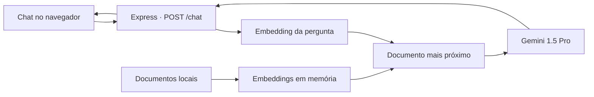

# Prothy — chatbot com Gemini e busca semântica

[](https://nodejs.org/)
[](https://expressjs.com/)
[](https://ai.google.dev/)

Protótipo de assistente virtual corporativo que combina uma interface web de chat, o modelo Gemini e recuperação de contexto a partir de documentos locais. O projeto foi criado para demonstrar, de ponta a ponta, como enriquecer respostas de IA com uma base de conhecimento específica.

## Visão geral

O Prothy atende perguntas sobre a Econsiste e seus serviços. Antes de enviar uma pergunta ao modelo generativo, a aplicação:

1. lê os documentos da pasta `database/`;
2. gera embeddings com o modelo `embedding-001`;
3. transforma a pergunta do usuário em um vetor;
4. encontra o documento mais próximo por distância euclidiana;
5. adiciona esse contexto ao prompt enviado ao `gemini-1.5-pro`.

O resultado é um fluxo simples de RAG (Retrieval-Augmented Generation) inteiramente mantido em memória, sem banco vetorial externo.



## Recursos demonstrados

- interface de chat responsiva em HTML, CSS e JavaScript;
- API HTTP com Express;
- geração de embeddings para documentos e perguntas;
- recuperação semântica por similaridade vetorial;
- histórico de conversa mantido pelo chat do Gemini;
- function calling para respostas controladas pela aplicação;
- renderização de respostas do assistente na interface web;
- configuração por variável de ambiente.

## Stack

| Camada | Tecnologia |
| --- | --- |
| Runtime | Node.js com ES Modules |
| Servidor | Express 4 |
| IA generativa | Google Gemini 1.5 Pro |
| Embeddings | Gemini `embedding-001` |
| Interface | HTML, CSS, JavaScript e Marked |
| Configuração | dotenv |

## Como executar

### Requisitos

- Node.js 20 ou superior;
- uma chave da Gemini API.

### Instalação

```bash
git clone https://github.com/Thiagof2755/IA_Model.git
cd IA_Model
npm install
cp .env.example .env
```

Preencha o arquivo `.env`:

```env
GEMINI_API_KEY=your_gemini_api_key_here
```

Inicie a aplicação:

```bash
npm start
```

Acesse [http://localhost:3000](http://localhost:3000). Ao abrir a página, a sessão de chat é inicializada e a interface passa a enviar as mensagens para a API.

## Endpoints

| Método | Rota | Descrição |
| --- | --- | --- |
| `GET` | `/` | Inicializa o chat e entrega a interface web. |
| `POST` | `/chat` | Recebe uma mensagem, recupera contexto e retorna a resposta do Gemini. |

Exemplo de requisição:

```bash
curl -X POST http://localhost:3000/chat \
  -H "Content-Type: application/json" \
  -d '{"mensagem":"Quais serviços a empresa oferece?"}'
```

## Estrutura

```text
IA_Model/
├── app.js                 # servidor Express e endpoints
├── chat.js                # orquestra recuperação e resposta do modelo
├── embedding.js           # leitura, embeddings e busca semântica
├── inicializaChat.js      # prompt inicial e function calling
├── database/              # base de conhecimento textual
├── templates/chat.html    # interface do chatbot
└── static/                # estilos, scripts e assets visuais
```

## Decisões e limitações

- os embeddings são calculados no início do processo e mantidos em memória;
- a busca seleciona apenas o documento com menor distância euclidiana;
- a sessão de chat é global no processo, portanto o protótipo não isola históricos por usuário;
- não há autenticação, persistência de mensagens ou limitação de requisições;
- a aplicação é um projeto demonstrativo e precisa dessas camadas antes de uma exposição pública em produção.

## Segurança

Nunca versione o arquivo `.env`. Use apenas `.env.example` para documentar os nomes das variáveis e mantenha chaves reais fora do Git.

## Possíveis evoluções

- dividir documentos em chunks e recuperar múltiplos trechos;
- usar similaridade de cosseno e um banco vetorial;
- criar sessões independentes por usuário;
- adicionar streaming de respostas;
- implementar testes automatizados e observabilidade.

## Autor

Desenvolvido por [Thiagof2755](https://github.com/Thiagof2755).
